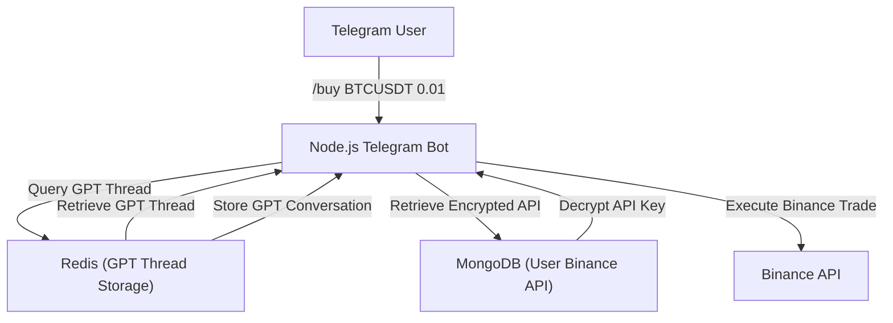

# 🚀 Crypto Telegram Bot

A Telegram bot that provides **real-time cryptocurrency prices, alerts, and portfolio tracking** using the **Telegraf framework** and **CoinGecko API**.

---

## 📌 Features

✅ Fetch live **crypto prices** from CoinGecko.  
✅ Track your **crypto portfolio**.  
✅ Fetch real-time **CoinGecko trading data**.  
✅ Supports **Telegram commands** like `/price`, `/news`, `/buy`, `/sell`, `/dex`, `/setting` and `/help`.  
✅ GPT Investment advice based on recent news.  
✅ Deployable on **Railway, AWS, or Heroku**.

---

## 🔧 Setup Instructions

### **1️⃣ Prerequisites**

- **Node.js** (v14+)
- **Telegram Bot API Token** (from [BotFather](https://t.me/BotFather))
- **CoinGecko API** (No API key required)

### **2️⃣ Clone the Repository**

```sh
git clone https://github.com/yourusername/crypto-telegram-bot.git
cd crypto-telegram-bot
```

### **3️⃣ Install Dependencies**

```sh
npm install
```

### **4️⃣ Set Up Environment Variables**

Create a `.env` file and add your **Telegram Bot API Key**:

```sh
TELEGRAM_BOT_TOKEN=your_telegram_bot_api_key
```

### **5️⃣ Run the Bot Locally**

```sh
node bot.js
```

Your bot is now running! Open **Telegram**, find your bot, and try:

```sh
/price bitcoin
```

---

## 🐝 System Architecture



---

## 🌟 Available Commands

| Command                   | Description                                                        |
| ------------------------- | ------------------------------------------------------------------ |
| `/start`                  | Start the bot                                                      |
| `/help`                   | Show available commands                                            |
| `/price <coin>`           | Get the current price of a cryptocurrency (e.g., `/price bitcoin`) |
| `/dex`                    | View your dex wallet balance                                       |
| `/buy <coin> <quantity>`  | Buy crypto with Binance API (e.g., `/buy bitcoin 0.5`)             |
| `/sell <coin> <quantity>` | Sell crypto with Binance API (e.g., `/sell bitcoin 0.5`)           |

---

## 📦 Deployment

You can deploy the bot on **Railway, Heroku, or AWS**.

### **Deploy on Railway** (Free Hosting)

1. Push your bot to **GitHub**.
2. Go to [Railway.app](https://railway.app/) → **New Project** → **Deploy from GitHub**.
3. Set the **environment variables**:
   - `TELEGRAM_BOT_TOKEN`
   - `BINANCE_APIKEY`
   - `BINANCE_APISECRET`
   - `METAMASK_API`
4. Click **Deploy** 🚀.

---

## 🎯 Future Improvements

✅ Add support for **NFT tracking** and **DeFi analytics**.  
✅ Implement **machine learning-based trading signals**.

---

## 🤝 Contributing

Feel free to **fork this project**, submit a PR, or suggest new features!

💎 Contact: [paulip114@gmail.com](mailto:paulip114@gmail.com)

---

## 🛠 Built With

- **Node.js** - Backend framework
- **Telegraf.js** - Telegram bot library
- **CoinGecko API** - Fetch live crypto prices
- **Redis** - Caching for faster responses
- **MongoDB** - Storing user portfolios

---

## 🐟 License

This project is licensed under the **MIT License** - see the [LICENSE](LICENSE) file for details.

---

🚀 **Start your Crypto Telegram Bot today!** Let me know if you need any improvements. 😃
